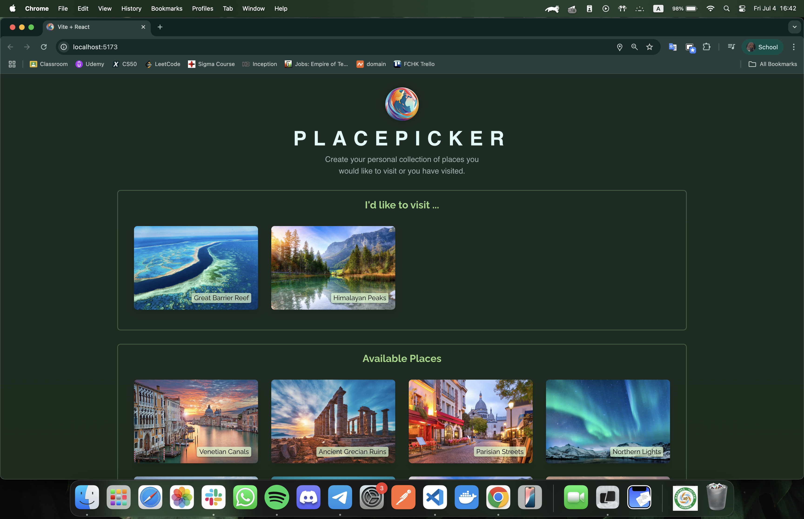

# PlacePicker Application

A modern React application that allows users to create a personal collection of places they'd like to visit. This project demonstrates **useEffect** hooks, API integration, state management, and geolocation features.



## 🎯 Learning Objectives

This project was created to practice and master:

- **useEffect** hook for data fetching and side effects
- **useState** hook for state management
- **useCallback** hook for performance optimization
- **API Integration** with async/await patterns
- **Error handling** in React applications
- Component lifecycle in functional components
- Modern React patterns and best practices

## ✨ Features

- 🗺️ **Place Collection**: Create and manage your personal wishlist of places to visit
- 📍 **Location-Based Sorting**: Available places sorted by distance from your current location
- 🔄 **Real-time Updates**: Add and remove places with immediate API synchronization
- ⚡ **Async Data Fetching**: Efficient data loading with loading states and error handling
- 🚨 **Error Management**: Comprehensive error handling with user-friendly messages
- 🗑️ **Confirmation Dialogs**: Safe deletion with confirmation modals
- 📱 **Responsive Design**: Beautiful UI that works on all devices
- 🌐 **Full-Stack Integration**: Frontend communicates with Express.js backend

## 🚀 Getting Started

### Prerequisites

- Node.js (v16 or higher)
- npm or yarn

### Installation

1. **Clone the repository**

   ```bash
   git clone <repository-url>
   cd placepicker
   ```

2. **Install frontend dependencies**

   ```bash
   npm install
   ```

3. **Install backend dependencies**

   ```bash
   cd backend
   npm install
   cd ..
   ```

4. **Start the backend server**

   ```bash
   cd backend
   node app.js
   ```

   The backend will run on `http://localhost:5050`

5. **Start the frontend development server**

   ```bash
   npm run dev
   ```

6. **Open your browser**
   Navigate to `http://localhost:5173`

## 🛠️ Technologies Used

### Frontend

- **React 19** - Frontend framework
- **Vite** - Build tool and dev server
- **useState** - Component state management
- **useEffect** - Side effects and data fetching
- **useCallback** - Performance optimization
- **CSS3** - Styling and animations
- **ESLint** - Code linting

### Backend

- **Express.js** - Web application framework
- **Node.js** - Runtime environment
- **JSON** - Data storage and management

## 🏗️ Project Structure

```
placepicker/
├── src/
│   ├── components/     # React components
│   ├── api/           # API service functions
│   ├── utils/         # Utility functions
│   └── assets/        # Images and static files
├── backend/
│   ├── data/          # JSON data files
│   └── app.js         # Express server
└── public/            # Static assets
```

## 🔧 API Endpoints

- `GET /places` - Fetch all available places
- `GET /user-places` - Fetch user's selected places
- `PUT /user-places` - Update user's selected places

## 📄 License

This project is open source and available under the [MIT License](LICENSE).
